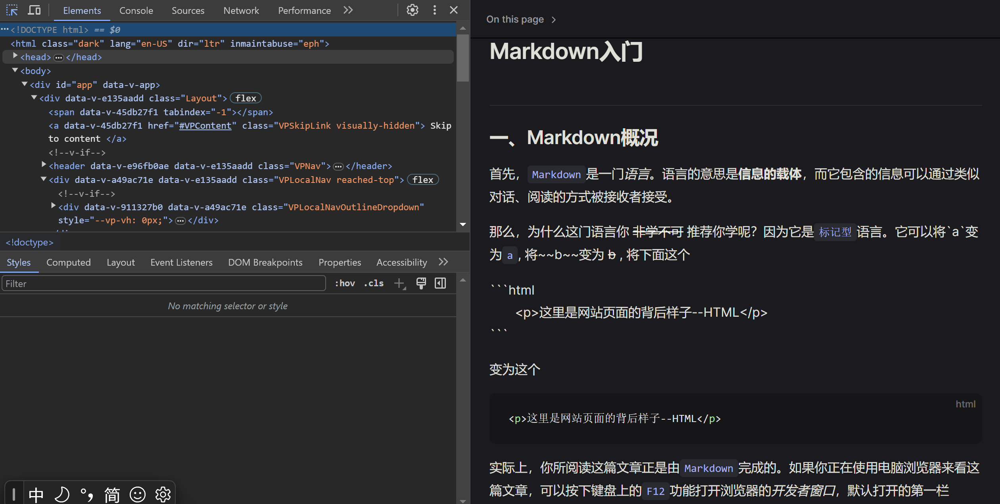

# Markdown入门

::: details 放在开头
  如果你只想知道如何使用`Markdown`, 那么你可以跳转到以下链接，它们在markdown的用法上介绍地更加详细与完整：  

- [Markdown 官方文档](https://www.markdownguide.org/basic-syntax/)
- [Markdown 中文教程](https://markdown.com.cn/)
:::

## Markdown概况

  首先，`Markdown`是一门*语言*。语言的意思是**信息的载体**，而它包含的信息可以通过类似对话、阅读的方式传递给接收者。  

  那么，为什么这门语言你 ~~非学不可~~ 推荐你学呢？因为它是`标记型`语言。它可以将\`a\`变为`a`, 将\~\~b\~\~变为 ~~b~~ ,
  将下面这个  

  \`\`\`html  
  　　\<p\>这里是网站页面的背后样子--HTML\</p\>  
  \`\`\`

  变为这个

  ```html  
   <p>这里是网站页面的背后样子--HTML</p>  
  ```

  实际上，你所阅读这篇文章正是由`Markdown`完成的。如果你正在使用电脑浏览器来看这篇文章，可以按下键盘上的`F12`功能打开浏览器的*开发者窗口*，默认打开的第一个标签页会显示如图：  

    
  
  可见位于Element标签页顶部，有一列  

  ```html
    <!DOCTYPE html>
  ```  

  这里提到的`html`, 就是99.9%浏览器呈现的页面背后的实质文件。浏览器对`html`进行处理最后输出成我们所见的页面，这个操作每时每刻都发生在我们网上🏄‍的同时。  
  
  关于`html`与`Markdown`的解释有下：  
  > HTML（Hypertext Markup Language）是一种标记语言
  >
  > Markdown是一种文本标记语言（Text Markup Language）

  `Markdown`本身就是用来快速转化为`html`的， 而`html`是用来快速转化为最终的浏览器页面的。只从**使用角度**来看，他们有以下关系：

  ```js
  　　// 伪代码
    Markdown --> html --> 浏览器页面
    Markdown之于html == html之于浏览器页面
  ```

  现在请你想想，为什么我会向你推荐`Markdown`？~~酷就完了~~如果上面的内容还不足以作为你的答案，那么请继续翻阅下面的内容。  
  
## Markdown能做什么

  **`Markdown`能做多少事情当然取决于上面提到的特点**。正是由于它是一门可以快速转化为可读性极强的页面信息(尤其是浏览器html页面)的*标记型*语言，它在这些场景下变得非常活跃：

- **文档编写**  
  <br />

  技术类文档通常使用`Markdown`来进行编写，例如本站。通常，技术类文章往往需要夹带代码文本，可快速进行定位的标题，图片以及超链接跳转等信息。`Markdown`就是为此而生的。  
  
- **开源社区**  
  <br />

  当前活跃的技术社区建立在浏览器页面的基础之上，所以，`Markdown`的流行也不出所料。

- **项目说明文件**  
  <br />

  在开源项目(公开源代码并进行一定程度使用授权的项目)中，一般都携带着说明文件，以开源社区[github](https://github.com)上的项目为例，在项目文件中通常有一个名为以下标签所示的文件。该文件用来说明其项目的基本内容。
  ::: code-group

  ``` [.md后缀]
  README.md 
  ```

  ``` [.markdown后缀]
  README.markdown
  ```  

:::

- **技术博客**  
  <br />
  
  正如本站，当你点击站点首页右上角的**github图标**时可进入本站的开源仓库。`markdown`是该站的核心语言，效果也如你所见。

## 如何使用Markdown

  通常，一门成熟的技术，学习它的最佳方式就是阅读其官方文档并实现文档demo。<br />
  :::　warning 💡温馨提示
  下列链接已预先放置在了本节开头，如果你下次再次访问本节内容，并有使用markdown方面的需求，请直接在开头访问外部链接。
  :::
  > [Markdown 官方文档](https://www.markdownguide.org/basic-syntax/)
  >
  > [Markdown 中文教程](https://markdown.com.cn/)

  当然，本站也提供了实现部分demo的视频--[Markdown Demo](https://www.bilibili.com/)。如果你的电脑已经安装好了[Visiual Studio Code](https://code.visualstudio.com/)此类编辑器，配合食用更佳。
  